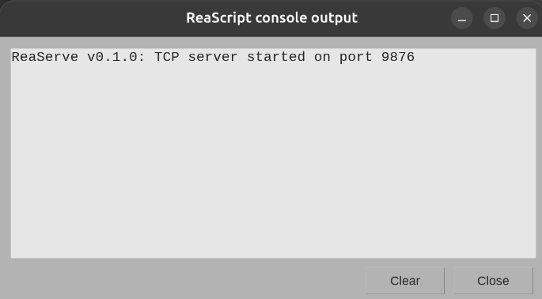
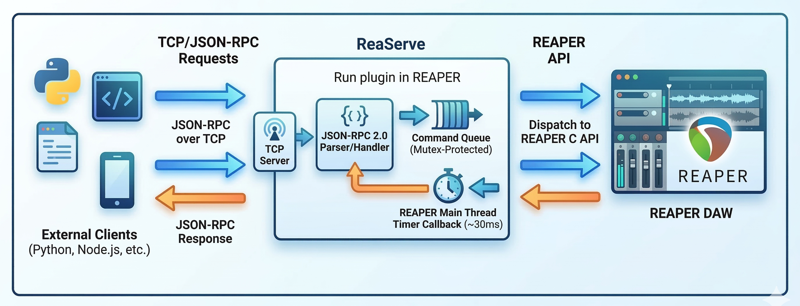
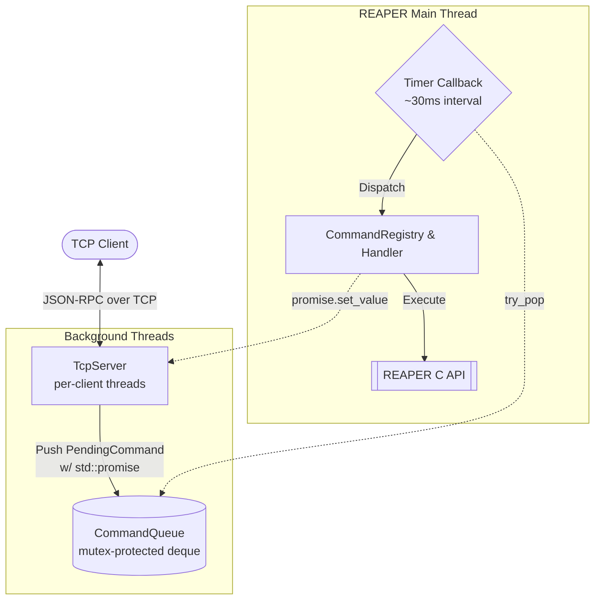

# ReaServe

A standalone C++ REAPER extension plugin that exposes common REAPER operations over TCP via JSON-RPC 2.0, with Lua scripting support for full API access.

Control REAPER from any language — Python, Go, Node.js, Rust, or anything that can open a TCP socket.

This project ahs been built to help facilitate AI integration with REAPER, but can be used for any remote control use case. This plugin does not require a "file based bridge" or for the http server to be enabled. It can execute commands and return results entirely over TCP.


## Installation

1. Download `reaper_reaserve` for your platform from [Releases](../../releases)
2. Copy to your REAPER `UserPlugins/` directory:
   - **Windows:** `%APPDATA%\REAPER\UserPlugins\`
   - **macOS:** `~/Library/Application Support/REAPER/UserPlugins/`
   - **Linux:** `~/.config/REAPER/UserPlugins/`
3. Restart REAPER
4. You should see "ReaServe: TCP server started on port 9876" in the REAPER console



## Configuration

On first load, ReaServe creates `reaserve.ini` in your REAPER resource path:

```ini
[reaserve]
port=9876
bind=0.0.0.0
```

## Quick Test

```bash
python examples/python_client.py
```

```bash
go run examples/go_client.go
```

If you have installed hte plugin correctly, the example scripts will print the JSON-RPC responses for the example commands sent in:

```
$ go run go_client.go

Ping: {"pong":true,"version":"0.1.0"}

Project: 120 BPM, 4 tracks
  Track 0: Melody (0.0 dB)
  Track 1: Bass (-1.9 dB)
  Track 2: Chords (-4.4 dB)
  Track 3: Drums (-0.9 dB)

Transport: stopped at 15.00s
  
Added track: {"index":4,"success":true,"track_count":5}
```


## Protocol

ReaServe uses **JSON-RPC 2.0** over TCP with **4-byte big-endian length-prefixed framing**.

See [PROTOCOL.md](PROTOCOL.md) for the complete method reference.

### Available Methods

| Category | Methods |
|----------|---------|
| Core | `ping` |
| Lua | `lua.execute`, `lua.execute_and_read` |
| Project | `project.get_state` |
| Transport | `transport.get_state`, `transport.control`, `transport.set_cursor` |
| Tracks | `track.add`, `track.remove`, `track.set_property` |
| Items | `item.list`, `item.move`, `item.resize`, `item.split`, `item.delete`, `items.get_selected` |
| FX | `fx.get_parameters`, `fx.add`, `fx.remove`, `fx.set_parameter`, `fx.enable`, `fx.disable` |
| MIDI | `midi.get_notes`, `midi.insert_notes` |
| Markers | `marker.list`, `marker.add`, `marker.remove` |
| Routing | `routing.list_sends`, `routing.add_send`, `routing.remove_send` |
| Envelopes | `envelope.list`, `envelope.add_point` |

## Building from Source

Requires CMake 3.15+ and a C++17 compiler.

```bash
cmake -B build -DCMAKE_BUILD_TYPE=Release
cmake --build build --config Release
```

The plugin binary will be at `build/reaper_reaserve.so` (Linux), `.dylib` (macOS), or `.dll` (Windows).

## Testing

### Unit tests

Unit tests run without REAPER and cover JSON-RPC framing, command queue, and message parsing:

```bash
ctest --test-dir build
```

### Integration tests

Integration tests run against a live REAPER instance and exercise every method in the protocol. They require Go 1.21+.

**Setup:**

1. Build and install the plugin into REAPER's `UserPlugins/` directory
2. Open REAPER with a **new, blank project** (no tracks, items, or markers)
3. Confirm ReaServe is running (you should see the startup message in the console)

**Run:**

```bash
cd tests/integration && go test -tags integration -v -count=1 .
```

To connect to a non-default address:

```bash
cd tests/integration && REASERVE_ADDR=192.168.1.10:9876 go test -tags integration -v -count=1 .
```

The tests create tracks, items, FX, MIDI notes, markers, sends, and envelope points — then clean everything up, leaving the project blank. Every method in [PROTOCOL.md](PROTOCOL.md) is covered.

The `integration` build tag ensures these tests are **never** picked up by normal `go test` runs or CI — they only compile and run when explicitly requested.

## Architecture

Note: The timer callback processes up to 5 commands per tick






REAPER's C API is not thread-safe. All API calls happen on the main thread via a timer callback. TCP threads block on `std::future` until the main thread processes their command.

## License

MIT
