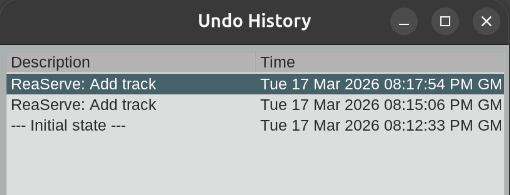

# ReaServe

A standalone C++ REAPER extension plugin that exposes common REAPER operations over TCP via JSON-RPC 2.0, with Lua scripting support for full API access.

Control REAPER from any language — Python, Go, Node.js, Rust, or anything that can open a TCP socket.

## Installation

1. Download `reaper_reaserve` for your platform from [Releases](../../releases)
2. Copy to your REAPER `UserPlugins/` directory:
   - **Windows:** `%APPDATA%\REAPER\UserPlugins\`
   - **macOS:** `~/Library/Application Support/REAPER/UserPlugins/`
   - **Linux:** `~/.config/REAPER/UserPlugins/`
3. Restart REAPER
4. You should see "ReaServe: TCP server started on port 9876" in the REAPER console


## Configuration

On first load, ReaServe creates `reaserve.ini` in your REAPER resource path:

```ini
[reaserve]
port=9876
bind=0.0.0.0
```

## Quick Test

```bash
python examples/python_client.py
```

```bash
go run examples/go_client.go
```

If you have installed hte plugin correctly, both should print the JSON-RPC response:

```
$ go run go_client.go

Ping: {"pong":true,"version":"0.1.0"}

Project: 120 BPM, 4 tracks

Added track: {"index":4,"success":true,"track_count":5}
```



## Protocol

ReaServe uses **JSON-RPC 2.0** over TCP with **4-byte big-endian length-prefixed framing**.

See [PROTOCOL.md](PROTOCOL.md) for the complete method reference.

### Available Methods

| Category | Methods |
|----------|---------|
| Core | `ping` |
| Lua | `lua.execute`, `lua.execute_and_read` |
| Project | `project.get_state` |
| Transport | `transport.get_state`, `transport.control`, `transport.set_cursor` |
| Tracks | `track.add`, `track.remove`, `track.set_property` |
| Items | `item.list`, `item.move`, `item.resize`, `item.split`, `item.delete`, `items.get_selected` |
| FX | `fx.get_parameters`, `fx.add`, `fx.remove`, `fx.set_parameter`, `fx.enable`, `fx.disable` |
| MIDI | `midi.get_notes`, `midi.insert_notes` |
| Markers | `marker.list`, `marker.add`, `marker.remove` |
| Routing | `routing.list_sends`, `routing.add_send`, `routing.remove_send` |
| Envelopes | `envelope.list`, `envelope.add_point` |

## Building from Source

Requires CMake 3.15+ and a C++17 compiler.

```bash
cmake -B build -DCMAKE_BUILD_TYPE=Release
cmake --build build --config Release
ctest --test-dir build
```

The plugin binary will be at `build/reaper_reaserve.so` (Linux), `.dylib` (macOS), or `.dll` (Windows).

## Architecture

```
TCP Client  -->  TcpServer (background thread, per-client threads)
                    | push PendingCommand with std::promise
                 CommandQueue (mutex-protected deque)
                    | try_pop() in timer callback
                 Timer (REAPER main thread, ~30ms interval)
                    | dispatch
                 CommandRegistry -> Handler -> REAPER C API
                    | promise.set_value(result)
                 TCP thread unblocks, sends response
```

REAPER's C API is not thread-safe. All API calls happen on the main thread via a timer callback. TCP threads block on `std::future` until the main thread processes their command.

## License

MIT
